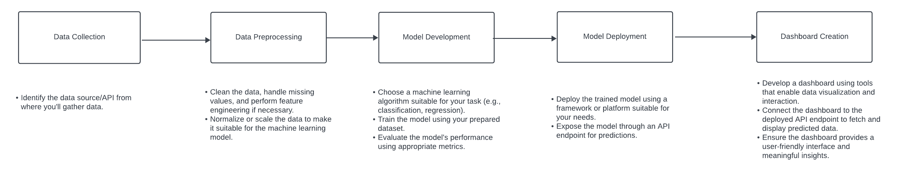
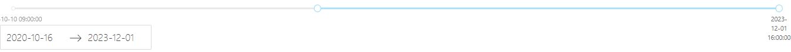
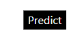
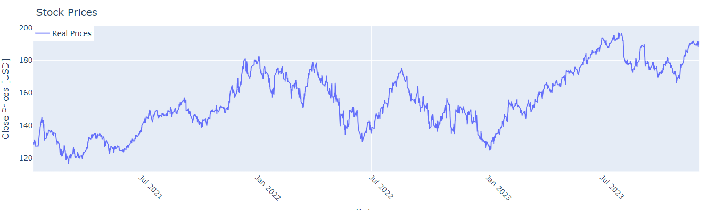
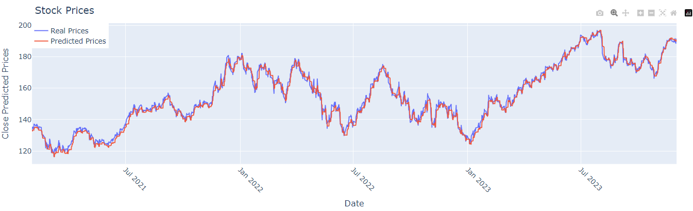
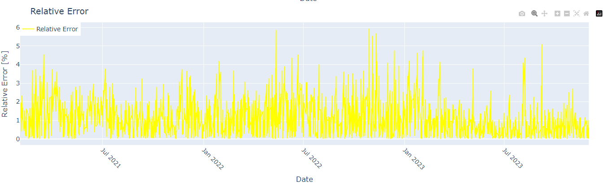
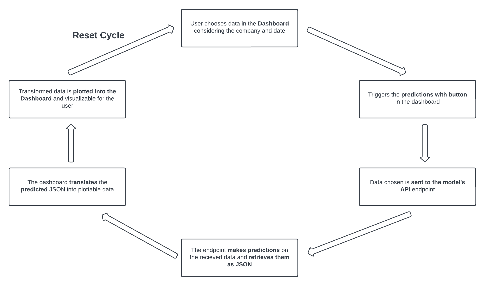

# ***Machine Learning for Stock Prices Predictions***

#### **Video Demo**:  <URL HERE>

### **Reasons for the Project**
The plan was to do a project that encapsulated both Data Science and Machine Learning. Creating a model or multiple models to make predictions, and then create a UI (Dashboard) where both real and predicted data is available and able to be visualized and contrasted. Determining what kind of data to predict was the first step into starting this project. I was mainly considering finance or medical data, and ended up deciding on finance, because considering that I wanted to predict a time-series type dataset, finance data was more suitable for this approach.

### **Work Pipeline**
Before starting the project, I stablished a work pipeline to follow so objectives and steps are more stablished and formulated.

#### 1. *Data Collection*:
Decide which dataset to use and what to predict, considering my wishes.
#### 2. *Data Preprocessing*:
Make the transformations needed to the data so it is cleaner, complete and suitable for the ML model to be created.
#### 3. *Model Development*:
Train and test different ML models and compare their results to choose between the best of them all considering the data we want to predict. The ML model chosen will be the one we use for shown predictions.
#### 4. *Model Deployment*:
Export and deploy the developed model, exposing it trough and API endpoint for predictions. This way, data-to-predict will be sent to the model and it will respond with the respective predictions.
#### 5. *Dashboard Creation*:
Create a dashboard to visualize the raw and predicted data, so it is contrasted, visualy attractive and easly interpreted for the user.

## **Details on the Development**
### 1. Collecting and Transforming Data
In the *Notebooks* section of the project, in the [*Data Collection.ipynb*](Notebooks/Data_Collection.ipynb) file. Data is extracted trough an API from the [StockData](https://www.stockdata.org/) webpage and from four different companies: *Apple, Tesla, Microsoft* and *Google*.

Data is retrieved in 180 day batches, starting from the date 2018-10-10 up to the date 2023-12-01. Data is extracted "backwards" meaning that it first extracts the most recent data and finishes extracting the oldest data.

Each row in the dataset extracted represents the prices of the stock in one hour. And each hour has the following information: date, ticker (company), open, high, low, close prices, and volume.

After collecting and exploring the data, it went trough a transforming process made in the notebook [*Data Transformation.ipynb*](Notebooks/Data_Transformation.ipynb) consisting of:
1. Normalizing the data (which I tried a couple different normalization methods)
2. Handling missing values (which had none)
3. Adding features (which I ended up not using, but it's still in the dataset)
4. "Flip" the data so the first rows are the oldest and not the most recent.

This way, the data is ready to be fed into a ML model.

### 2. Building the Model
The model building is separated between the different companies datasets in the following notebooks:
- [Apple: Model Development](Notebooks/Model_Development_Apple.ipynb)
- [Tesla: Model Development](Notebooks/Model_Development_Tesla.ipynb)
- [Microsoft: Model Development](Notebooks/Model_Development_Microsoft.ipynb)
- [Google: Model Development](Notebooks/Model_Development_Google.ipynb)

The attribute to be predicted is the stock close price. So the models will be trained upon predicting this attribute.

I was considering making a specific model for each dataset, but it ended up being the same model with the same architecture. The model used was a Long-Short Term Memory Neural Network (LSTM) with TensorFlow.

The model is trained upon instances of the same attribute in different moments in time, so let's say that to predict the n'th value of the dataframe (our target *Y*), for that given *Y*, our *X* will be the *n-99* up to n values of the same attribute to be predicted (so our window is of size 100).

The data is separated this way to be able to be fed into the model.

The architecture can be seen in any of the Model Development notebooks.

### 3. Deploying the Model
Once the model was done training and testing, for each of the companies, I exported them into an .pkl files.

Then, in [models.py](Dashboard/models.py) loaded all the previously created models, and created an API endpoint using Flask with different route methods corresponding to each of the models, so we know which model to use when the endpoint is reached.

This endpoint is waiting to recieve data, when recieved, depending on the route, it will use one of the specific models to predict values on the recieved data. After making the predictions, it will retrieve them as a JSON.

The dashboard is the element that will access this endpoint.

### 4. Dashboard Creation:
The structure of the dashboard consists of two parts:
1. The main: [main.py](Dashboard/main.py)
2. The modules:
    - [apple_dashboard.py](Dashboard/modules/apple_dashboard.py)
    - [tesla_dashboard.py](Dashboard/modules/tesla_dashboard.py)
    - [microsoft_dashboard.py](Dashboard/modules/microsoft_dashboard.py)
    - [google_dashboard.py](Dashboard/modules/google_dashboard.py)

The modules are composed of the following main elements:
- Title and logo of the company. 
- Date slider to choose between two points of the available dates. 
- A predict button that sends the data selected to the model's endpoint. 
- A scatter plot where it shows the composition of the data (close prices) throughout time on the given company.
- A scatter plot of the predicted data when triggered by the button and retrieved, shown on the same graph on top of the real data.
- A relative error graph that shows the error between the real and predicted data.

The structure of all modules are the same, the only real difference between the modules are the data, the logo and the name that is deployed, depending on the company we're located.

The main script functions as a main menu that connects all the different companies, it allows the user to switch between the different modules.

**Note**: The [errors.py](Dashboard/modules/errors.py) script is used by all the modules to calculate the error, and is separated just to not duplicate innecessary code between the different modules.

## **Data Flow and Predictions**
The process that takes places when trying to predict any data in the architecture of this project is the following:

